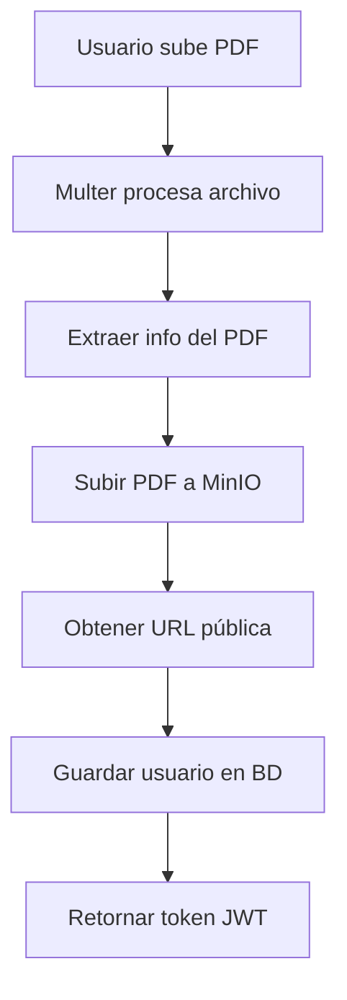

# Documentación: Configuración de MinIO para Code Room API Auth

## Tabla de Contenidos

1. [Introducción](#introducción)
2. [Prerrequisitos](#prerrequisitos)
3. [Configuración de MinIO con Docker](#configuración-de-minio-con-docker)
4. [Configuración del Proyecto](#configuración-del-proyecto)
5. [Implementación en el Código](#implementación-en-el-código)
6. [Flujo de Funcionamiento](#flujo-de-funcionamiento)
7. [Comandos Útiles](#comandos-útiles)
8. [Resolución de Problemas](#resolución-de-problemas)

## Introducción

MinIO es un servidor de almacenamiento de objetos compatible con Amazon S3 que permite almacenar archivos de forma local. En este proyecto, utilizamos MinIO para almacenar los certificados PDF de los estudiantes que se registran en el sistema.

### Ventajas de MinIO sobre AWS S3:

- ✅ **Gratuito**: No hay costos por almacenamiento o transferencia
- ✅ **Local**: Control total sobre los datos
- ✅ **Compatible con S3**: Misma API que AWS S3
- ✅ **Fácil configuración**: Setup rápido con Docker
- ✅ **Desarrollo**: Ideal para entornos de desarrollo y testing

## Prerrequisitos

Antes de comenzar, asegúrate de tener instalado:

- [Docker Desktop](https://www.docker.com/products/docker-desktop/)
- [Docker Compose](https://docs.docker.com/compose/) (incluido con Docker Desktop)
- Node.js y npm (para el proyecto principal)

## Configuración de MinIO con Docker

### 1. Archivo docker-compose.yml

Crea o verifica que tengas el siguiente archivo `docker-compose.yml` en la raíz del proyecto:

```yaml
services:
  minio:
    image: minio/minio:latest
    container_name: code-room-minio
    ports:
      - "9000:9000" # API MinIO
      - "9001:9001" # Console Web MinIO
    environment:
      MINIO_ROOT_USER: minioadmin
      MINIO_ROOT_PASSWORD: minioadmin123
    volumes:
      - minio_data:/data
    command: server /data --console-address ":9001"
    restart: unless-stopped
    healthcheck:
      test: ["CMD", "curl", "-f", "http://localhost:9000/minio/health/live"]
      interval: 30s
      timeout: 20s
      retries: 3

  minio-setup:
    image: minio/mc:latest
    container_name: code-room-minio-setup
    depends_on:
      - minio
    entrypoint: >
      /bin/sh -c "
      sleep 10;
      mc alias set myminio http://minio:9000 minioadmin minioadmin123;
      mc mb myminio/certificados --ignore-existing;
      mc anonymous set public myminio/certificados;
      echo 'MinIO bucket configurado correctamente';
      "
    restart: "no"

volumes:
  minio_data:
    driver: local
```

### 2. Iniciar MinIO

Ejecuta los siguientes comandos en la terminal:

```bash
# Navegar al directorio del proyecto
cd /ruta/a/tu/proyecto

# Iniciar MinIO en segundo plano
docker-compose up -d

# Verificar que los contenedores estén ejecutándose
docker ps
```

### 3. Verificar la Configuración

```bash
# Verificar que el bucket esté configurado correctamente
docker exec code-room-minio mc anonymous get myminio/certificados
```

Deberías ver: `Access permission for 'myminio/certificados' is 'public'`

## Configuración del Proyecto

### 1. Variables de Entorno (.env)

Configura las siguientes variables en tu archivo `.env`:

```properties
# Credenciales de MinIO (Local Docker)
MINIO_ENDPOINT=http://localhost:9000
MINIO_USER=minioadmin
MINIO_PASS=minioadmin123
URL_S3=http://localhost:9000/certificados/
```

### 2. Dependencias de Node.js

Asegúrate de tener instalado el SDK de AWS (compatible con MinIO):

```bash
npm install @aws-sdk/client-s3
```

## Implementación en el Código

### 1. Servicio S3 (src/services/s3Service.ts)

```typescript
import { S3Client, PutObjectCommand } from "@aws-sdk/client-s3";

const MINIO_ENDPOINT = process.env.MINIO_ENDPOINT!;
const MINIO_USER = process.env.MINIO_USER!;
const MINIO_PASS = process.env.MINIO_PASS!;
const URL_S3 = process.env.URL_S3!;

const s3 = new S3Client({
  region: "us-east-1",
  endpoint: MINIO_ENDPOINT,
  credentials: {
    accessKeyId: MINIO_USER,
    secretAccessKey: MINIO_PASS,
  },
  forcePathStyle: true, // Importante para MinIO
});

/**
 * Sube un archivo PDF a MinIO desde memoria (buffer)
 * @param file El archivo PDF recibido por multer
 * @returns URL pública del archivo subido
 */
export const uploadPdfToBucket = async (
  file: Express.Multer.File
): Promise<string> => {
  const uniqueName = \`\${Date.now()}-\${file.originalname}\`;

  try {
    await s3.send(
      new PutObjectCommand({
        Bucket: "certificados",
        Key: uniqueName,
        Body: file.buffer,
        ContentType: file.mimetype,
      })
    );

    const url = \`\${URL_S3}\${uniqueName}\`;
    return url;
  } catch (err) {
    console.error("Error al subir a MinIO:", err);
    throw new Error(
      "Error subiendo el PDF al bucket: " + (err as Error).message
    );
  }
};
```

### 2. Controller de Registro (src/controllers/registerController.ts)

```typescript
import { uploadPdfToBucket } from "../services/s3Service";

export const registerUser = async (req: Request, res: Response) => {
  try {
    // ... validaciones y procesamiento del PDF ...

    // Subir el PDF a MinIO y obtener la URL
    const pdfUrl = await uploadPdfToBucket(req.file);

    // Registrar al usuario con la URL del certificado
    const newStudent = await createUser(studentRegisterInfo, pdfUrl);

    // ... resto del código ...
  } catch (error) {
    // ... manejo de errores ...
  }
};
```

### 3. Middleware Multer (src/middlewares/multer.ts)

```typescript
import multer from "multer";

// Configuración para almacenar archivos en memoria
const storage = multer.memoryStorage();

export const upload = multer({
  storage: storage,
  limits: {
    fileSize: 10 * 1024 * 1024, // 10MB máximo
  },
  fileFilter: (req, file, cb) => {
    if (file.mimetype === "application/pdf") {
      cb(null, true);
    } else {
      cb(new Error("Solo se permiten archivos PDF"));
    }
  },
});
```

## Flujo de Funcionamiento

### 1. Proceso de Registro con Certificado



### 2. Flujo Técnico Detallado

1. **Recepción del archivo**: Multer recibe el PDF y lo almacena en memoria como buffer
2. **Procesamiento**: Se extrae información del certificado (QR, datos del estudiante)
3. **Subida a MinIO**: El PDF se sube al bucket "certificados" con nombre único
4. **Generación de URL**: Se genera la URL pública accesible del archivo
5. **Almacenamiento en BD**: Se guarda el usuario con la URL del certificado
6. **Respuesta**: Se retorna el token JWT y los datos del usuario

### 3. URLs Generadas

Los archivos se almacenan con el siguiente patrón:

```
http://localhost:9000/certificados/{timestamp}-{nombre-original}.pdf
```

Ejemplo:

```
http://localhost:9000/certificados/1703273400000-certificado-estudiante.pdf
```

## Comandos Útiles

### Docker y MinIO

```bash
# Iniciar servicios
docker-compose up -d

# Ver logs de MinIO
docker logs code-room-minio

# Ver logs del setup
docker logs code-room-minio-setup

# Parar servicios
docker-compose down

# Eliminar todo (incluyendo volúmenes)
docker-compose down -v

# Reiniciar solo MinIO
docker-compose restart minio

# Estado de contenedores
docker ps
```

### Comandos MinIO Client (mc)

```bash
# Configurar alias
docker exec code-room-minio mc alias set myminio http://localhost:9000 minioadmin minioadmin123

# Listar buckets
docker exec code-room-minio mc ls myminio

# Verificar permisos del bucket
docker exec code-room-minio mc anonymous get myminio/certificados

# Configurar bucket como público
docker exec code-room-minio mc anonymous set public myminio/certificados

# Listar archivos en el bucket
docker exec code-room-minio mc ls myminio/certificados
```

### Desarrollo

```bash
# Iniciar el proyecto
npm run dev

# Verificar conectividad con MinIO
curl http://localhost:9000/minio/health/live

# Acceder a la consola web
# http://localhost:9001
# Usuario: minioadmin
# Contraseña: minioadmin123
```

## Resolución de Problemas

### Problema: MinIO no inicia

**Síntomas**: Error al hacer `docker-compose up -d`

**Solución**:

```bash
# Verificar puertos ocupados
netstat -an | findstr ":9000"
netstat -an | findstr ":9001"

# Si están ocupados, cambiar puertos en docker-compose.yml
ports:
  - "9002:9000"  # Cambiar puerto local
  - "9003:9001"  # Cambiar puerto local
```

### Problema: Bucket no es público

**Síntomas**: Error 403 al acceder a URLs de archivos

**Solución**:

```bash
# Reconfigurar permisos
docker exec code-room-minio mc anonymous set public myminio/certificados

# Verificar
docker exec code-room-minio mc anonymous get myminio/certificados
```

### Problema: Error de conexión desde la aplicación

**Síntomas**: Error "Connection refused" o similar

**Solución**:

1. Verificar que MinIO esté ejecutándose:

   ```bash
   docker ps | grep minio
   ```

2. Verificar variables de entorno en `.env`:

   ```properties
   MINIO_ENDPOINT=http://localhost:9000
   MINIO_USER=minioadmin
   MINIO_PASS=minioadmin123
   ```

3. Reiniciar la aplicación:
   ```bash
   # Ctrl+C para parar
   npm run dev
   ```

### Problema: Archivos no se ven en la consola web

**Síntomas**: Los archivos se suben pero no aparecen en http://localhost:9001

**Solución**:

- Refrescar la página web
- Verificar que estés navegando al bucket correcto: "certificados"
- Ejecutar: `docker exec code-room-minio mc ls myminio/certificados`

## URLs de Acceso

| Servicio         | URL                                          | Credenciales               |
| ---------------- | -------------------------------------------- | -------------------------- |
| **API MinIO**    | http://localhost:9000                        | N/A                        |
| **Consola Web**  | http://localhost:9001                        | minioadmin / minioadmin123 |
| **Health Check** | http://localhost:9000/minio/health/live      | N/A                        |
| **Archivos PDF** | http://localhost:9000/certificados/{archivo} | Públicamente accesible     |

## Configuración de Producción

Para un entorno de producción, considera:

1. **Cambiar credenciales por defecto**:

   ```yaml
   environment:
     MINIO_ROOT_USER: tu_usuario_seguro
     MINIO_ROOT_PASSWORD: tu_contraseña_muy_segura
   ```

2. **Usar volúmenes persistentes**:

   ```yaml
   volumes:
     - /ruta/local/data:/data
   ```

3. **Configurar HTTPS** con certificados SSL
4. **Implementar backup** de los datos
5. **Monitoreo** y logs centralizados

---

## Conclusión

Con esta configuración tienes:

- ✅ MinIO funcionando localmente
- ✅ Bucket público para certificados
- ✅ Integración completa con tu API
- ✅ URLs públicas para acceso a archivos
- ✅ Setup automatizado con Docker Compose

El sistema está listo para desarrollo y testing. Los archivos PDF se almacenan de forma segura y son accesibles mediante URLs públicas que se guardan en la base de datos junto con la información del usuario.
